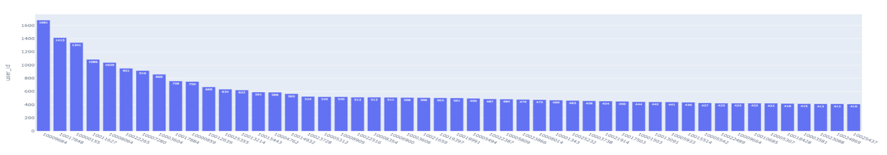
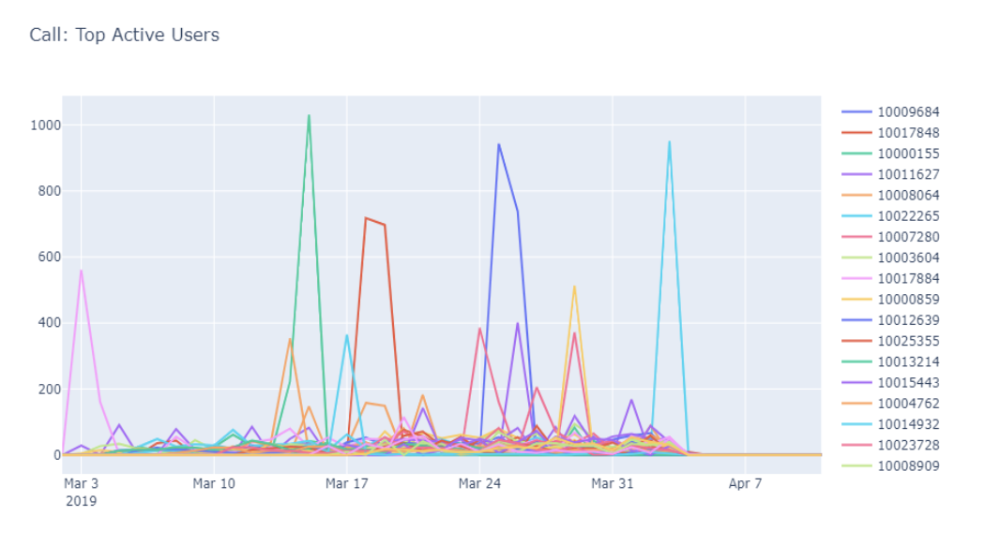
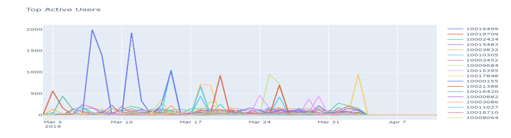
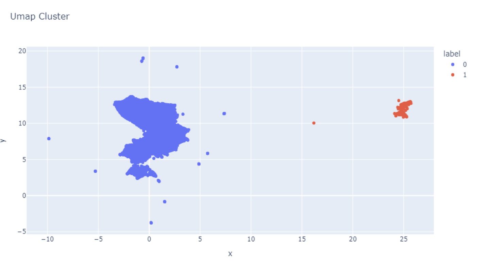
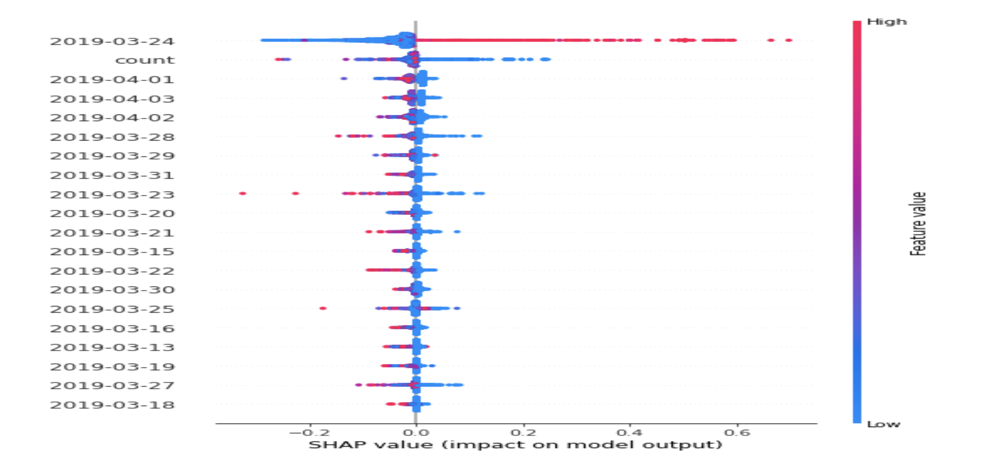
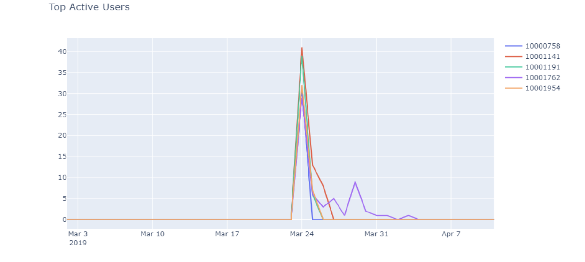

# Telecommunication Fraud Detection

## Objective Statement

**The battle against fraudsters is never-ending, the telecomm company is trying to make information open and readily available, but scammers, scripters, and scrapers are trying to break our rules, and they are always looking for ways to improve detection of anomalous and suspicious activities.**

- To Provide an effective measure to identify the ongoing suspicious and fraudulent looking activity inside company.
- Explore the data insights using preferred methods
  -   Get business insight about what does average user behavior look like?
  -   Get business insight about what might activity from fraud/scrapers look like?
      - these scrapers are interested in harvesting our search data over time
      - there is no certainty about the definition of fraud - need to establish criteria

## Challenges 
  - The data contain real and imagined examples of scrapers following different patterns
  - Some scrapers behave in the similar manner (as with bots), some are independent
  - TimeStamps are important in some cases
  - There are somewhere between 200-2000 fraudulent user_ids mixed with regular users.
  
## The Data (contains real and imagined examples of scraper following different patterns):

  - signup_data.csv: Triggered when users signup on telecomm app, 26000 different users with country code and sign up timestamp in millisecond
  - search_data.csv: A phone number -> name search, triggered by call/user, 867131 search records
  - call_data.csv: timestamps of when users made/received calls, 1223795 calling records with timestamps.
  - message_data.csv: timestamps of when users sent/received SMS, 105785 messaging records with timestamps

## Solution Steps:

1. Business Understanding: Understanding the problem our client is trying to solve. Is it scoped and solvable?

2. Data Preprocessing: Once the problem is scoped, gather data from relevant source and clean data as neccessary.

3. Exploratory Data Analysis: Find significant patterns and trends using statistical methods.	

4. Model Building: Construct model to predict and forecast	

5. Data Product: Drawing conclusion from data, evaluating meaning of results and communicating it to business

## 1. Business Understanding

This case has some business question using the data:
-   What does average user behavior look like?
-   What might activity from fraud/scrapers look like?
      - these scrapers are interested in harvesting our search data over time
      - there is no ceratinty about the definition of fraud - need to establish criteria

## 2. Data Preprocessing

Data Files were provided for four different event types triggered by app namely signup, search, message and call information of the users.
All these files were present in raw unreadable format and below are the steps taken in data preprocessing.

Data Cleaning: The raw files consisted of a single column which was combination of two information namely userid and event timestamp relating to the search activity  performed by user etc. So, data cleansing was done which involved splitting the column into user id and event timestamp fields, converting the timestamp field into human readable format, filling up the missing values etc.

Data Transformation: Converted the format of the raw files into efficient and usable format for analysis. Created functions and used operations like new column addition, type conversion, pivoting, joining etc. for making the data format supportable for analysis and visualization. Used pandas and plotly extensively.

## 3. EDA
i) KPI: Call volume by each user.
Analysing the Overall  behaviour of Top 50 users with most calls.

- Top 50 users have call records of very high volume ranging from 1681 for user id ‘10009684’  to  410  for user id ‘10025437’

ii) KPI : Day wise behavior of users .
Analysing the Day wise behaviour of Top  and bottom 50 users with most and least calls.

                                      
- Top 50 users have daily call records distributed and can be divided into 2 categories. Some users call activity peaking up for only 2 or 3 days while for rest of the days being inactive. For ex- caller 10009684 called 943 times on 25th March and  738  times on 26th March. Rest other days,it was inactive. Some users call activity are high consistently  on all the days. For ex- 10003606 has call activity of around 25 times ranging regularly  from 6th March 2019 to Apr 3, 2019

## 4. Model Building

Performed dimensionality reduction via UMAP, followed by clustering algo for labeling including data containing features relating to -  Day wise behavior of users , call/search/message volume of users

Trends:
Observed that there are 2 clusters formation 
The blue cluster shows the data points of the users with low to moderate activity of call/search/message.
The Red Cluster  depicts a trend of users going from normal  behavior activity to sudden spike in activity  of search/call/message performed  across a period.This shows an irregular and suspicious behavior compared to the rest of the users.

- Appended the clustering label to the data, Split the data into train-test and used random forest to train the classifier. Used Shap lib to generate feature importances. 

- Higher user activity on a particular day (24th March 2019) compared to the rest of the days for users falling under red cluster.

Top Suspected Id's

- The graph shows suspected user id’s with their daily activity trend. Picked up 5 user Ids for showing the analysis.
Sudden spike in the user’s activity on 24th March compared to their normal activity over the rest of the days. There are around 685 such user ids. 

## 5. Conclusion
In this case study, I presented the analysis of suspicious or fraudulent looking activity by using data techniques such as preprocessing, analysis, visualization, ml clustering techniques to detect the behavior of suspicious users. 
The approach helped in answering below questions:
- What does average behavior look like?
Based on analysis, we found that the users with low to  moderate activity of calls, messages and searches on most of the days comes under average behavior.
- What might activity from scapers look like?
Users with high volume of call, message and search activity on particular days..
Sudden huge spike in the user’s activity from the usual trend. For example- user id ‘10012879’ has  call,search and message activity peaking up to 357 volume only for one particular day while rest other days, there was no activity.

Note: Please refer to the ipython notebook for going through a detail-analysis on solution steps.

  

